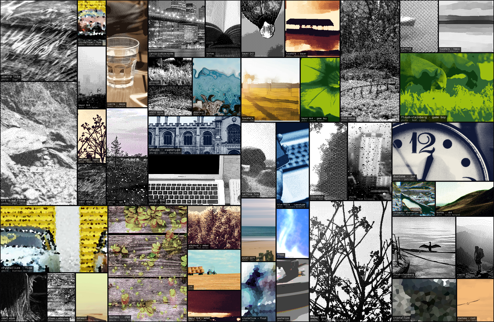
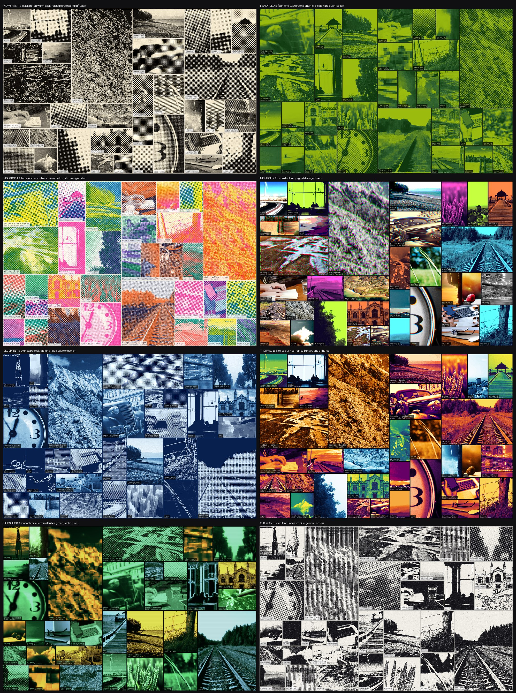
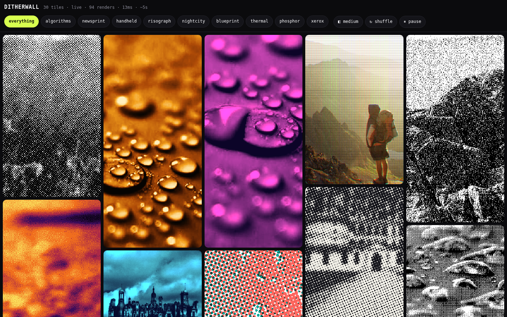
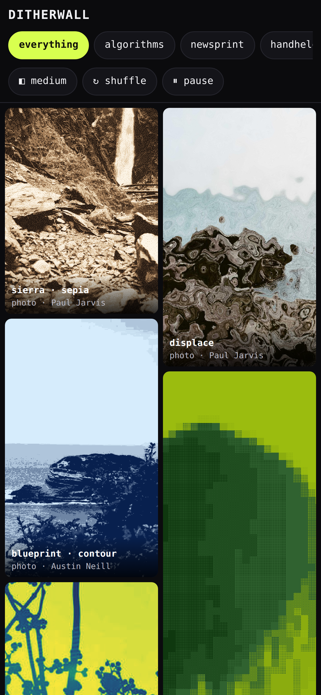

# ditherwall

Forty-odd dithering and shader-style algorithms, applied to real photographs and
rendered onto a single canvas so they can be compared at a glance.

**Live: [ditherwall.pages.dev](https://ditherwall.pages.dev)** — running on your
own GPU, no server behind it.



Three front ends over one set of algorithms:

| | What it is | Where it runs |
|---|---|---|
| [`ditherwall/`](ditherwall) | NumPy engine — renders posters, and is the reference implementation | Locally, offline |
| [`web/`](web) | Server-rendered gallery, one tile per request | `http.server`, containerised |
| [`gpu/`](gpu) | WebGL2 wall, animated and pointer-reactive | The viewer's GPU, served as static files |

Every tile is a different algorithm on a different photograph, cropped at its own
zoom and framing. The layout is a recursive split rather than a grid, so the tile
shapes vary and the result reads as a composition instead of a contact sheet.

## Genres

The default wall is deliberately heterogeneous — it exists to compare algorithms
against each other. A genre does the opposite: it fixes the palette, screen and
finish so every tile reads as one process, and the variation becomes variation
*within* a style.



| Genre | Process |
|---|---|
| `newsprint` | Black ink on warm stock, rotated screens at 15°/45°/60°, engraving hatch |
| `handheld` | Four-tone LCD greens, chunky sprite pixels, hard quantisation |
| `risograph` | Two spot inks, separate screen angles, deliberate misregistration |
| `nightcity` | Neon duotones, chromatic aberration, pixel sort, signal damage |
| `blueprint` | Cyanotype stock, drafting lines, edge extraction |
| `thermal` | False-colour heat ramps — ironbow, magma, arctic, sodium |
| `phosphor` | Monochrome terminal tubes in green, amber and ice, with glow bleed |
| `xerox` | Crushed tone curve, toner speckle, generation loss over three passes |

## Run it

```bash
pip install numpy pillow
cd ditherwall
python3 render.py                                  # 2600×1700, 40 tiles
python3 render.py --genre risograph --tiles 30     # a single style
python3 render.py --tiles 24 --seed 3 --no-labels  # a different wall
```

Photographs are pulled from Picsum's Unsplash-backed catalogue and cached in
`cache/`, so only the first run needs network. `--seed` controls photo choice,
crops, and layout together; the same seed always reproduces the same wall.

## What's in it

| Family | Count | Examples |
|---|---|---|
| Error diffusion | 13 | Floyd–Steinberg, Atkinson, Jarvis–Judice–Ninke, Stucki, Burkes, Sierra |
| Ordered / threshold | 8 | Bayer 2×2/4×4/8×8, blue noise, white noise |
| Screen & line | 4 | Rotated halftone, crosshatch engraving, Sobel edges |
| Shader-style | 13 | Kuwahara, CRT aperture mask, crystallize, pixel sort, bloom, displace |
| Composites | 4 | `bloom → atkinson`, `kuwahara → bayer`, `crt → halftone` |

Palettes include monochrome, Game Boy, CGA, C64, and three duotones. Every error
diffusion kernel can target any palette.

Everything is plain NumPy — no GPU, no shader compiler. The "shader" effects are
the same operations a fragment shader would do, computed on the CPU.

## Live gallery

A web front end over the same engine. Every tile independently pulls its own
random photograph and its own random effect, rendered server-side, and refreshes
on its own jittered timer — so the wall changes continuously and unevenly rather
than blinking over all at once.

```bash
python3 web/server.py --port 8000     # then open http://127.0.0.1:8000
```

| | |
|---|---|
|  |  |

No framework and no build step — `http.server` with a thread pool on the back,
one HTML/CSS/JS file each on the front. Genre chips switch the whole wall between
the eight presets or the full 135-effect mix.

**Responsive.** A CSS grid of `auto-fill / minmax(min(--tile, 46vw), 1fr))`, with
tiles spanning a random number of 10px rows so heights stay uneven. Tile count is
derived from the viewport. Captions reveal on hover on desktop but are pinned on
under `@media (hover: none)`, since a touch screen has no hover.

**Tiles are requested at device pixels.** A tile asks for `CSS size × devicePixelRatio`
and the image is `image-rendering: pixelated`. Dithering is a per-pixel pattern —
letting the browser resample it turns the whole point of the exercise to mush.

**Pre-rendering.** An effect costs 20ms to about a second, too slow to sit inside
a request on a phone. Worker threads render ahead of demand into a per-size cache,
so a request normally pops a finished tile — measured 0.55s cold, under 5ms warm.
Requested dimensions are rounded to an 80px grid to keep the number of cache keys
small; `object-fit: cover` absorbs the difference.

**Percent-encoded metadata headers.** The effect name and photographer ride back
on `X-Effect` / `X-Author`. `http.server` encodes headers as latin-1, which cannot
represent the en-dash in `floyd–steinberg` or the arrow in `bloom → atkinson`;
before this was fixed roughly a third of requests died with `UnicodeEncodeError`.
Values are percent-encoded on the way out and decoded in the client.

`web/shoot.py` drives the page in real Chromium at desktop and mobile viewports,
and doubles as a smoke test — it fails on console errors, failed requests, or
tiles that never finish loading.

## GPU wall

A second front end that renders the effects as WebGL2 fragment shaders on the
viewer's own GPU. No server compute at all, so it deploys as static files — and
because it runs at frame rate, the effects can *move*: screen angles rotate,
dither grain crawls, riso registration drifts, and everything responds to the
pointer.


```bash
python3 tools/build_corpus.py     # optimised photos + manifest + blue noise
cd gpu && python3 -m http.server 8123
```

**One context, not one per tile.** Browsers cap concurrent WebGL contexts at
roughly 8–16, so a canvas per tile fails outright past a dozen. The canvas covers
the page instead, and each tile is drawn by setting `gl.viewport` to its rectangle
and running a full-screen quad through that tile's program.

**Photographs ship with the site.** WebGL textures must be same-origin or
CORS-enabled, and Picsum sends no CORS header. Serving a bundled corpus sidesteps
the question and removes any runtime dependency on a third-party CDN or its rate
limits — 36 photographs at 1024px come to 3.9 MB.

**Statistics the shader cannot compute are measured on the CPU.** `normalize_tone`
needs luminance percentiles and a mean, neither of which a fragment shader can
derive without an extra pass. Once per tile the crop is drawn into a 32×32 canvas
and read back, which gives both for one `drawImage`, and they go in as uniforms.

Measuring the *crop* rather than the whole photograph matters: a tight crop of sky
inside a high-contrast frame gets almost no stretch from whole-image percentiles
and dithers to a flat field. An earlier version did this inside the shader, at
nine texture fetches on *every pixel*, to recompute a value that is constant
across the tile — removing that took the software-rendered frame rate from 5 fps
to 13.

## Depth-aware processes

A photographic process is normally applied uniformly across a frame. With a depth
map it can vary *through the scene* instead.

Monocular depth is estimated offline — Depth Anything V2 (small, quantised) via
ONNX Runtime — and shipped as a greyscale image beside each photograph, so at
runtime it is just another texture and costs nothing. 36 maps come to 0.6 MB.

```bash
python3 tools/build_depth.py     # downloads the model on first run
```

| Preset | What varies with distance |
|---|---|
| `depth dither` | Matrix resolution: fine near, coarse far. The pointer sweeps the plane of best resolution through the scene |
| `depth screen` | Halftone ruling opens up with distance, and tone washes out — atmospheric perspective, in dots |
| `depth planes` | Depth cut into flat bands, each printed in its own ink: a separation by distance rather than by colour |
| `parallax` | Near pixels shift further than far ones, so a flat photograph gains volume while the dither grain stays put |
| `fog` | The process holds near and dissolves into haze with distance |

## Chrome

The wall is the page; the interface stays out of it.

There is no header. A small block sits in the bottom-left corner — current
style, tile count, frame rate — resting at low opacity and waking on any pointer
movement. The style list grows *upward* out of that corner, so the wall below it
stays clear.

Captions were the bigger intrusion: thirty-five permanent labels covered more of
the wall than any header did. Only the tile under the pointer is captioned now,
and the caption fades out with the chrome rather than staying stuck to the last
tile hovered. `L` pins them all on for reading the wall.

| Key | |
|---|---|
| `1`–`9`, `0` | style |
| `space` | freeze |
| `r` | shuffle |
| `l` | pin captions |
| `f` | fullscreen |
| `h` | hide all chrome |
| `?` | keys |

`window.setGenre(name)` is exposed so the capture and test scripts can drive the
wall without depending on chrome that is usually invisible.

## Focus and motion

Clicking a tile expands it to fill the canvas. Because tiles are `gl.viewport`
rectangles rather than DOM elements, that is interpolated numbers — no layout, no
reflow. The crop interpolates at the same time, so the tile relaxes out of its
tight framing into the whole photograph as it grows: focusing *reveals* the frame
rather than just magnifying it.

**The rest of the wall coarsens rather than blurring.** Blurring a live one-bit
dither turns it to grey mush and throws away the pattern, which is the thing
worth looking at. Instead every screen-space process enlarges — bigger cells,
chunkier matrices, sparser screens — through a single `uCoarsen` uniform that
divides the coordinate `screenPx()` returns. It reads as depth of field
expressed in print, costs one uniform, and needs no framebuffer.

**Style changes ripple.** A genre switch no longer rebuilds the wall. Layout,
photographs and crops stay put; only the effect changes, staggered by distance
from wherever the change was triggered, reusing the per-tile cross-fade that
already existed. Nothing is re-measured, so nothing jumps.

**Motion runs on springs, not eased tweens**, because springs are interruptible —
clicking another tile mid-flight redirects rather than snapping.

They are integrated in fixed sub-steps rather than one step of the frame time.
Explicit Euler diverges once `damping × dt` passes 2 — around 74ms here — so on a
slow frame the value ran away instead of settling. It reached 2.35 on a software
rasteriser, which pushed the dim past 1 and rendered the whole wall black. Fixed
sub-stepping converges identically from 120fps down to 6.

## Morph transitions

Tiles hold a process for a while, then cross-fade into another. Both are drawn
and the incoming one composites over the outgoing at rising alpha, smoothstepped
— a linear fade spends too long looking like a double exposure. Timings are
staggered per tile, so the wall never changes all at once.

## Differential harness

`tools/diff_harness.py` renders every ported effect in real Chromium and compares
it against the NumPy reference. It does not compare pixels — the two will never
match exactly — but the properties that break when a shader is wrong:

| Metric | Catches |
|---|---|
| **structure** | Both downsampled to 32×32 and correlated. Collapses when a shader samples the wrong region or renders a flat field |
| **exposure** | Mean luminance. Catches clipping to black or white |
| **ink** | Fraction of dark pixels. Catches a dither losing its tone curve |

It earned its keep immediately. Structure came back at ~0.35 across the board,
with **negative** correlation on two cases — a sign of geometry, not tuning.
WebGL's texture origin is bottom-left while an image uploads top row first, so
`vUv.y = 0` was sampling the top of the photograph: **every image on the wall had
been rendering upside down since the first commit**, invisible because tight
crops of dithered texture have few orientation cues. After the fix, structure
runs 0.94–0.999.

It also exposed a real quality gap. The shader was stretching tone by whole-photo
percentiles while the reference used per-crop ones, so a tight crop got the wrong
normalisation. Both now measure the crop, and the remaining error falls under
0.01 on most cases.

The harness runs in CI and gates deployment.

Sixteen shader programs across eight genres, 61 presets: ordered dithering,
halftone, gradient maps, riso, CRT, chromatic aberration, bloom, crystallize,
kuwahara, phosphor, xerox, crosshatch, Sobel edges, duotone, displace, datamosh.

Error diffusion does not port: it is sequential by construction. It stays on the
CPU and is not part of the GPU wall.

**`gl_FragCoord` is not tile-local.** Every tile is drawn through its own
`gl.viewport`, but `gl_FragCoord` stays in framebuffer coordinates — a tile at
x=900 sees `gl_FragCoord.x ≈ 900`, not 0. Screen-space patterns like halftone
and Bayer are unaffected, and in fact look better for it, since the screen runs
continuously across the whole wall. Anything that converts back to a UV must use
`vUv` instead: crystallize did not, so its facets sampled far outside the texture
and clamped to an edge pixel, leaving distant tiles flat black.

## Deploying

The GPU wall is what is deployed, and it is static files — no server, no runtime
compute, nothing to keep warm. It lives on **Cloudflare Pages** at
[ditherwall.pages.dev](https://ditherwall.pages.dev).

`.github/workflows/deploy.yml` runs on every push touching `gpu/`:

```
check   →  serve gpu/ locally, run the differential harness against real Chromium
deploy  →  wrangler pages deploy gpu --project-name=ditherwall
```

`deploy` declares `needs: check`, so a shader that stops matching the NumPy
reference blocks the release rather than shipping. That is not hypothetical — it
has already caught a broken run.

**Two repository secrets** (Settings → Secrets and variables → Actions):

| Secret | Scope |
|---|---|
| `CLOUDFLARE_API_TOKEN` | Account → Cloudflare Pages → **Edit**, and nothing else |
| `CLOUDFLARE_ACCOUNT_ID` | From the dashboard URL |

Wrangler reads both straight from the environment; neither is ever echoed. The
workflow fails with an explicit message if either is missing, rather than letting
wrangler produce something cryptic.

`main` publishes to the production domain. Any other branch gets its own preview
URL — `<branch>.ditherwall.pages.dev` — which is how this was reviewed before it
had a trunk.

**Cache rules** live in [`gpu/_headers`](gpu/_headers). Photographs, depth maps
and the noise texture only change when the corpus is rebuilt, so they are
immutable for a year; the entry point is held to a minute, because caching it
hard would leave a deploy invisible until the edge expired it.

Cloudflare Pages was chosen over the alternatives for one reason: this is an
image-heavy site, and its free tier is the only one without a bandwidth cap.
Since rendering happens on the viewer's GPU, there is no compute to pay for
either — the whole thing runs at no cost.

### Deploying the server-rendered gallery instead

The `Dockerfile` and `render.yaml` at the root belong to [`web/`](web), the
server-rendered gallery — a separate front end that predates the GPU port and is
kept because it exercises the NumPy engine end to end. It is *not* what serves
ditherwall.pages.dev.

```bash
docker build -t ditherwall .
docker run -p 8000:8000 ditherwall
```

Deployment there is also a pull rather than a push: connect the repo in the
Render dashboard (**New → Blueprint**) and it reads `render.yaml`. No token
changes hands.

The photo corpus is baked into the image at build time; fetching at boot would
make every cold start wait on ~30 HTTP round trips.

**Tuning knobs**, all environment variables, all read at startup:

| Variable | Default | Effect |
|---|---|---|
| `DW_WORKERS` | 3 | Render threads. More than the core count just adds contention |
| `DW_MAX_EDGE` | 720 | Longest tile edge. Cost is roughly quadratic in this |
| `DW_PHOTOS` | 44 | Corpus size — memory and image size |
| `DW_CACHE_DEPTH` | 4 | Pre-rendered tiles held per size bucket |

The Blueprint sets 480px / 2 workers, because a free instance gets a fraction of
a core and cost scales with area. On a paid plan, raise both.

**That client throttles itself.** Refresh interval is derived from measured
latency rather than fixed: N tiles refreshing every T seconds demand `N/T`
renders per second against a capacity of about `workers/latency`. So on a fast
machine tiles turn over every ~5s, and on a slow host the interval stretches
toward its 90s ceiling instead of piling up a queue the server can never drain.

## Notes on the implementation

Three things turned out to matter more than the algorithms themselves.

**Tone normalization before quantization.** Dithering is unforgiving about
exposure: a bright photo reduced to two levels clips to near-solid white and the
pattern vanishes. `normalize_tone` stretches each tile to full range and
gamma-shifts its mean toward mid grey first, which is what makes the kernels
comparable to each other rather than to their source photos.

**Bayer matrix normalization.** The recursive matrix has to be scaled as
`(m + 0.5) / n²`, not `m / n²`. Without the half-step the matrix mean sits below
0.5, which biases every threshold and darkens the output — at 2×2 a 50% grey
renders as 25% white. Verified against uniform patches: each matrix now
reproduces input tone to within its own quantization limit.

**Ramp palettes must be dithered in luminance.** Nearest-colour matching in RGB
is correct for a scattered palette like C64, but wrong for a tonal ramp: the Game
Boy palette is four greens, so a green-ish photograph lands near the light end for
every pixel and the tile comes out a flat field. `RAMP_PALETTES` routes those
through `ramp_error_diffuse` / `ramp_ordered`, which quantise luminance into
level indices and diffuse the error per step.

**Crops that seek detail.** A random window at high zoom regularly lands on blank
sky, which dithers into a dead grey field. Each tile proposes several candidate
crops and keeps the one with the most local gradient energy. The largest tiles
also get the most detailed photographs, since an empty tile is most conspicuous
at size.

Error diffusion runs on Python lists rather than NumPy arrays — the access
pattern is inherently sequential, and scalar indexing into an `ndarray` costs
more per access than plain float arithmetic. A full 2600×1700 wall renders in
about 11 seconds.

## Layout

```
ditherwall/          NumPy engine — posters, and the reference implementation
  fetch.py             photo corpus + caching
  effects.py           all algorithms, plus the EFFECTS registry
  genres.py            style presets: palette, screen and finish per genre
  layout.py            recursive canvas splitting, detail-seeking crops
  render.py            composition and labelling

gpu/                 WebGL2 wall — what ships to Cloudflare Pages
  shaders.js           GLSL ports, 16 programs
  presets.js           palettes, ramps and inks bound to those programs
  layout.js            the splitting algorithm, ported
  main.js              one context, tone measurement, morph, chrome
  diff.html            headless bench the differential harness drives
  _headers             Pages cache rules
  photos/ depth/       bundled corpus and its depth maps
  manifest.json        corpus index

web/                 server-rendered gallery
  server.py            http.server + a pre-rendering worker pool
  static/              one HTML/CSS/JS file each
  shoot.py             Chromium capture, doubles as a smoke test

tools/
  build_corpus.py      optimised photos, manifest, blue-noise texture
  build_depth.py       monocular depth maps via ONNX Runtime
  diff_harness.py      GPU vs NumPy, gates deployment

.github/workflows/
  deploy.yml           harness, then wrangler pages deploy
```

Photographs are from Unsplash via Picsum and are credited in each tile's caption.
